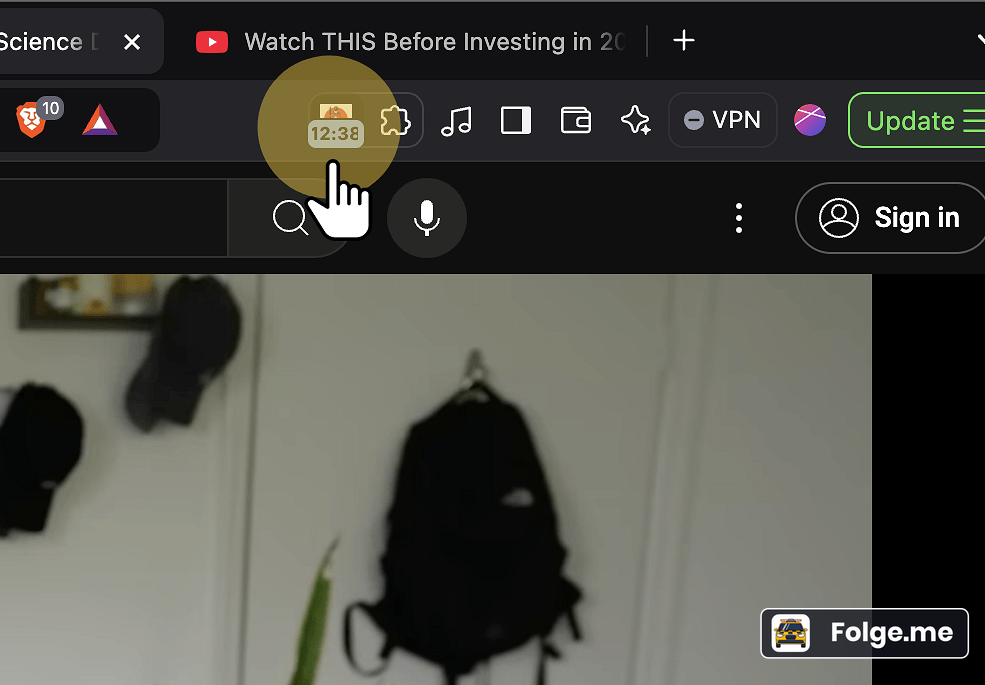
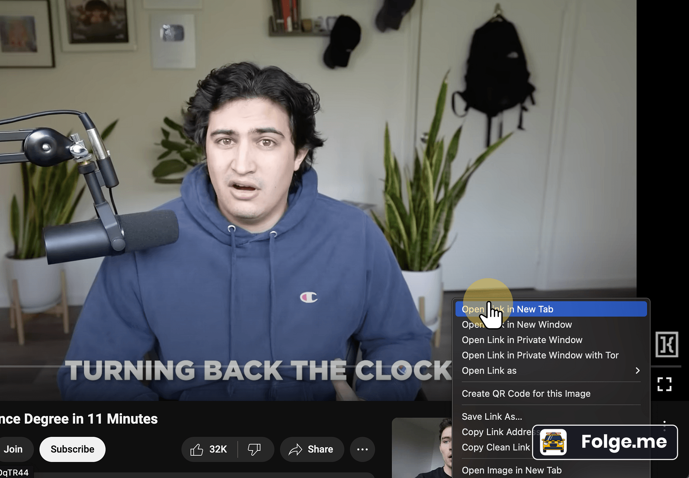
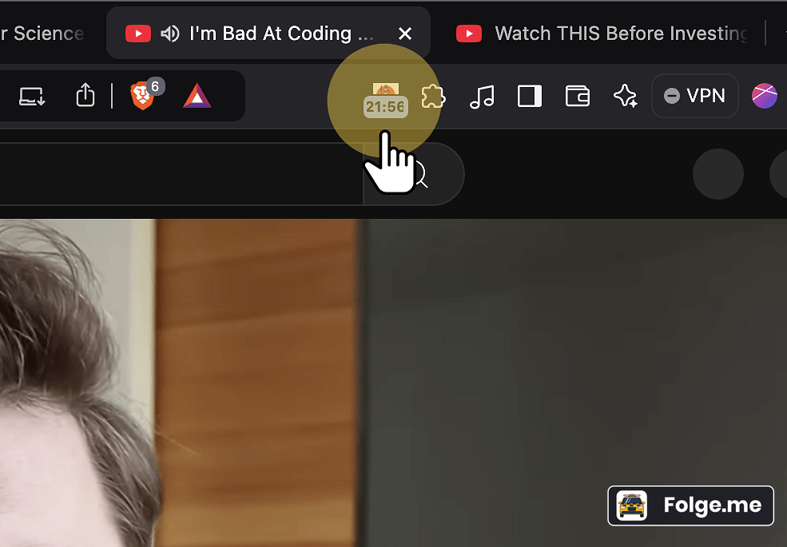

# Binge Watchman for YouTube

Ever found yourself lost in the YouTube rabbit hole? One video leads to another, and suddenly, hours have passed. 

Meet **Binge Watchman for YouTube** – your trusty sidekick for managing YouTube binge-watching. Keep track of your total watch time and stay in control.

## 🌟 The Story

It started on a lazy weekend. A quick catch-up on trending videos turned into an all-night marathon. 

As the sun rose, it was clear – something had to change. 

That's when **Binge Watchman for YouTube** was created. It helps you track time spent on YouTube across all open tabs. No more losing track!

## 🎬 Demo

|  |  |  |
|:--------------------:|:---------------------:|:--------------------:|
| **Step 1**: I'm watching a YT video, and it shows the total time here. | **Step 2**: Classic YouTube temptation! Got sidetracked by another video and, as usual, opened it in a new tab to watch later. | **Step 3**: The Watchman has detected the total time. |

## 🚀 Features

- **Real-time Tracking**: Tracks the total watch time for YouTube videos across all open tabs.
- **Badge Updates**: Shows total duration on the extension icon.
- **Popup Dashboard**: Open the popup to see your watch time and read funny messages.
- **Friendly Reminders**: As your watch time grows, you'll get gentle reminders to take a break.

## 🧰 To Do

- [ ] Add settings for customizing the reminder messages.
- [ ] Implement dark mode for the popup.
- [ ] Track watch history for insights into viewing habits.
- [ ] Improve performance by optimizing background processes.
- [ ] Add support for more video platforms beyond YouTube.

## 🤝 Contributing

We welcome contributions to improve this extension!

## 🙏 Acknowledgments

Thanks to **Github Copilot** for assisting in the development process.

---

Keep your binge-watching in check. Remember, moderation is key! Enjoy **Binge Watchman for YouTube**!
